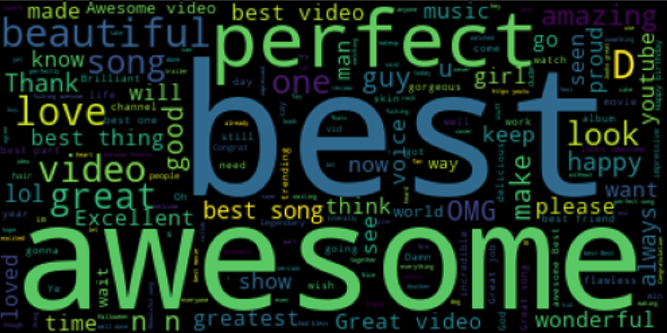
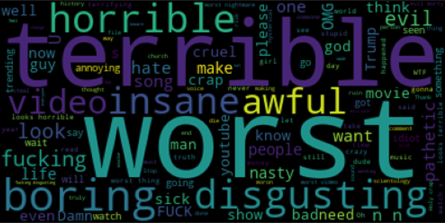
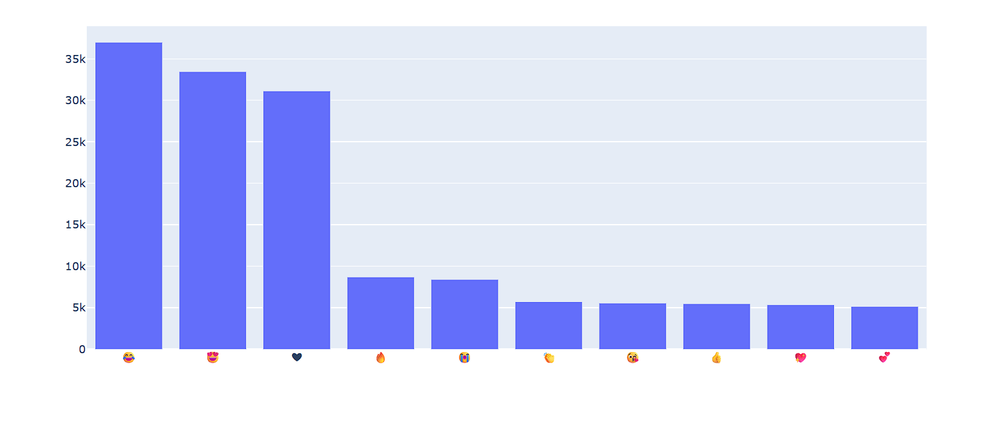
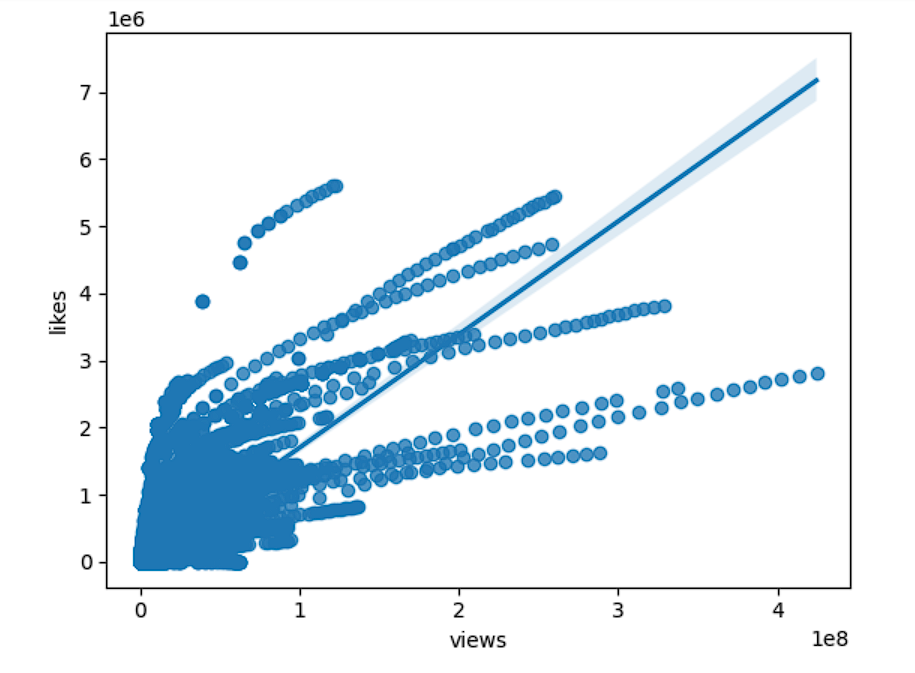
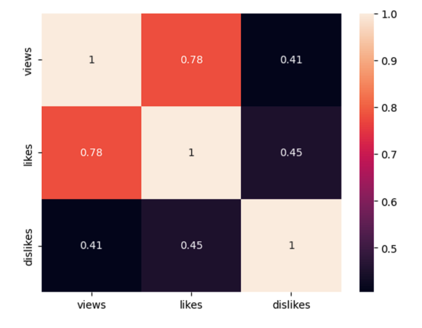
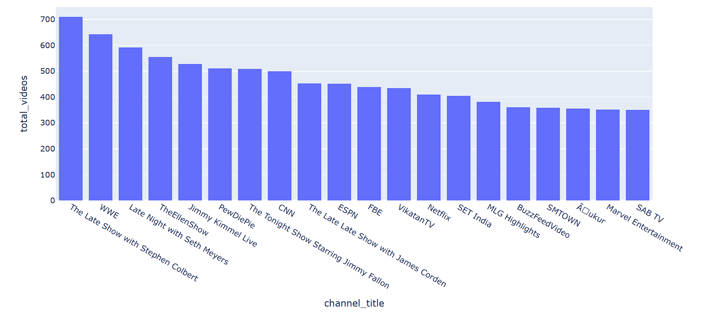
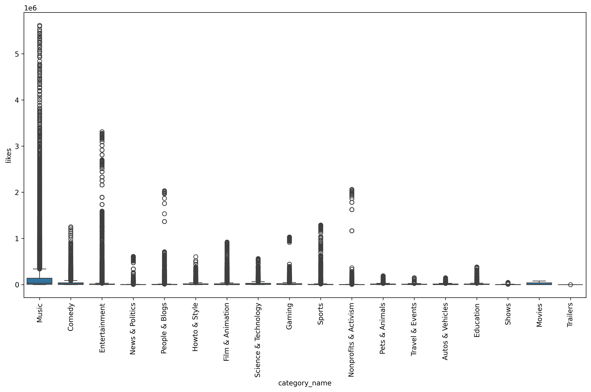
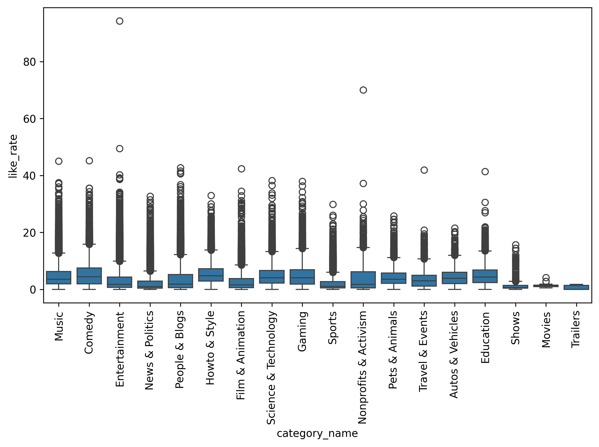

# 📊 Exploratory Data Analysis (EDA) of YouTube Data in Python

🎬 Cleaning, analyzing, and visualizing real YouTube datasets for actionable insights.

---

## 1. Project Title

**YouTube Trending Video & Comment Analytics — EDA in Python** 🐍

## 2. Summary

This project analyzes 691,400+ real YouTube comments and trending video records to uncover audience sentiment, emoji behavior, engagement patterns, and category-level performance trends.

## 3. Overview

YouTube generates massive volumes of comment and engagement data every day. This project turns that raw data into clear, visual insights. It covers data cleaning, sentiment analysis, emoji analysis, and engagement metrics across categories and channels. The goal is simple: show what drives views, likes, and audience reactions on YouTube.

## 4. Problem Statement

Creators and brands need to know what content performs well and how audiences react to it. Raw YouTube data is large, messy, and unstructured. This project answers four questions:

- What do positive and negative commenters say?
- Which emojis dominate audience reactions?
- How do views, likes, and dislikes relate to each other?
- Which categories and channels get the most engagement?

## 5. Dataset

| Detail | Value |
|---|---|
| File 1 | `video_id_info.csv` (comment-level data) |
| Rows | 691,400 |
| Columns | 4 (`video_id`, `comment_text`, `likes`, `replies`) |
| File 2 | `youtube_sample.csv` (video-level trending data, 1,000-row sample) |
| Columns | `video_id`, `trending_date`, `title`, `channel_title`, `category_id`, `views`, `likes`, `dislikes`, `comment_count`, `tags`, and more |
| Source | YouTube trending dataset (public, Kaggle-style structure) |

⚠️ Note: the comment dataset is large (691K+ rows). Loading and processing it requires `on_bad_lines='skip'` and patience on lower-spec machines.

## 6. Tools and Technologies

- **Python** 🐍
- **Pandas** – data cleaning and wrangling
- **NumPy** – numerical operations
- **Matplotlib** & **Seaborn** – static visualizations
- **Plotly** – interactive bar charts
- **TextBlob** – sentiment polarity scoring
- **WordCloud** – word frequency visuals
- **emoji** – emoji extraction from text

```python
import pandas as pd
import numpy as np
import seaborn as sns
import matplotlib.pyplot as plt
```

## 7. Methods

1. **Data Cleaning** — loaded the raw CSV, checked for nulls, dropped missing rows.
2. **Sentiment Analysis** — used TextBlob to score each comment's polarity (-1 to +1). Split comments into positive and negative groups.
3. **Word Cloud Analysis** — generated word clouds for positive and negative comment groups to surface dominant language.
4. **Emoji Analysis** — extracted every emoji from comments, counted frequency, and plotted the top 10 with Plotly.
5. **Multi-File Aggregation** — merged multiple regional trending CSVs into one combined dataframe and removed duplicates.
6. **Category Mapping** — mapped `category_id` to readable category names using YouTube's category JSON file.
7. **Engagement Metrics** — calculated `like_rate`, `dislike_rate`, and `comment_count_rate` as a percentage of views.
8. **Correlation Analysis** — measured relationships between views, likes, and dislikes using a regression plot and a correlation heatmap.
9. **Channel Analysis** — grouped data by channel to find which channels post the most trending videos.

## 8. Key Insights

- 😄 Positive comments cluster around words like **best, awesome, perfect, amazing, love**.
- 😡 Negative comments cluster around words like **terrible, worst, horrible, boring, disgusting**.
- 😂 The top emoji used in comments is the laughing-face emoji, followed by heart-eyes and black-heart.
- 📈 Views and likes show a strong positive correlation (**0.78**). Likes and dislikes show a moderate correlation (**0.45**).
- 🎵 The **Music** category has the highest absolute like counts, but **Entertainment** has standout outlier spikes in like rate.
- 📺 **The Late Show with Stephen Colbert**, **WWE**, and **Late Night with Seth Meyers** post the most trending videos overall.

## 9. Dashboard / Output

| Visual | Preview |
|---|---|
| Positive sentiment word cloud |  |
| Negative sentiment word cloud |  |
| Top 10 emoji usage |  |
| Views vs likes regression plot |  |
| Correlation heatmap (views, likes, dislikes) |  |
| Top channels by trending video count |  |
| Category-wise likes distribution |  |
| Category-wise like rate distribution |  |

## 10. How to Run This Project

```bash
# 1. Clone the repository
git clone https://github.com/<your-username>/youtube-eda-python.git
cd youtube-eda-python

# 2. Install dependencies
pip install pandas numpy seaborn matplotlib plotly textblob wordcloud emoji

# 3. Launch the notebook
jupyter notebook Youtube.ipynb
```

Make sure `video_id_info.csv` and `youtube_sample.csv` sit in the same folder as the notebook, or update the file paths inside the notebook to match your local setup.

## 11. Results & Conclusion

This project shows that YouTube engagement data carries strong, readable patterns once cleaned and visualized. Sentiment splits cleanly into recognizable positive and negative vocabularies. Emoji use skews heavily toward humor and affection. Views and likes move together closely, confirming that audience approval scales with reach. Category and channel-level breakdowns highlight where engagement concentrates, giving creators and analysts a clear view of what content performs.

## 12. Future Work

- Build a real-time sentiment classifier using a trained ML model instead of TextBlob's rule-based polarity.
- Add time-series analysis to track how engagement changes across trending days.
- Build an interactive Plotly Dash or Streamlit dashboard for live filtering by category and channel.
- Expand the dataset to include multiple countries for cross-regional comparison.

## 13. Author & Contact

**Gulfam Raza**
🎓 B.Tech – Information Technology, RKGIT Ghaziabad

🏆 Final CGPA: 8.02, First Division with Distinction

Specialization: Data Analytics & its related roles.

📧 Email: razagulfam0786@gmail.com
 💼 LinkedIn: [linkedin.com/in/your-profile](https://www.linkedin.com/in/gulfamraza1)
📱 Mobile: +91-6395528887

---

⭐ If you found this project useful, consider giving it a star on GitHub.
